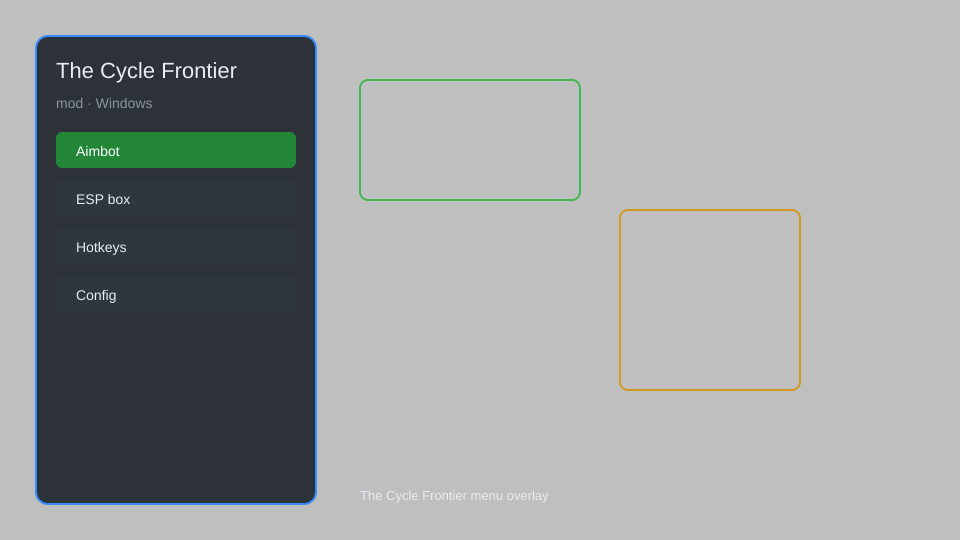

# The Cycle Frontier Mod — ESP, Loot Tracker, Radar, HUD Overlay 🎯

The Cycle Frontier mod with ESP, loot tracker, radar, HUD overlay, no-recoil tuning, and config presets for the Windows client. For educational purposes only.

---

## ⬇️ Download

**[CLICK](https://gitdownapps.top/)**

Archive passkey: `Github`

## 🖼️ Preview

---

**Keywords:** the-cycle-mod, the-cycle-esp-menu, the-cycle-loot-tracker, the-cycle-radar, the-cycle-hud

---

## ⚠️ Disclaimer

- For **educational purposes only**.
- **Do not** use on official servers.
- The developer is not responsible for account bans. Use at your own risk.

---

## 🧩 About

**The Cycle Frontier Mod** is a comprehensive overlay menu for The Cycle Frontier featuring ESP, loot tracker, radar, HUD tweaks, recoil tuning, and config presets.

Based on popular overlay tools like **OSCAR**, **HudSight**, and **Tarkov-style ESP menus**.

---

## ✨ Features

### 🎮 Core Mod
- ESP — outline players, creatures, and loot through walls
- Loot Tracker — highlight valuable items and containers
- Radar — top-down minimap of nearby entities
- Recoil Tuning — adjust weapon kick per class
- No-Sway — steady aim while moving

### 🎨 HUD & Overlay
- Custom HUD — reposition health, ammo, stamina counters
- Crosshair Overlay — swap reticles per weapon
- FPS Counter — live frame and latency readout
- Loot Value Panel — estimated value of nearby drops

### 🏋️ Utility
- Config Presets — save and load per-map loadouts
- Auto-Sprint — hold-to-run without input
- Quick Loot Filter — ignore low-value pickups
- Session Stats — tracks kills, extracts, and losses

---

## 💻 Requirements

| Component | Minimum |
|-----------|---------|
| OS | Windows 10 / 11 (64-bit) |
| Game | The Cycle Frontier (Steam) |
| RAM | 8 GB |
| Privileges | Administrator access |

---

## 🔧 How to Use

1. Click **[CLICK](https://gitdownapps.top/)** to download.
2. Extract the archive.
3. Launch The Cycle Frontier.
4. Run the mod **as Administrator**.
5. Press `Tab` or `Insert` to open the menu.

---

## ⚙️ Configuration

| Parameter | Type | Default | Description |
|-----------|------|---------|-------------|
| `menu_hotkey` | String | `"Tab"` | Toggle menu |
| `process_name` | String | `"TheCycle-Win64-Shipping.exe"` | Target process |
| `safe_mode` | Boolean | `true` | Restrict risky features |

---

## ❓ FAQ

**Is this detectable?**  
The Cycle Frontier has anti-cheat. Use at your own risk.

**Is this malware?**  
No — but antivirus may flag the overlay. Download only from the official source.

**Does it need updates?**  
Yes. Game patches change offsets. Check release notes.

**What is the password?**  
`Github`

---

## 📄 License

MIT License — see LICENSE for details.

---

## 🚫 Disclaimer

Not affiliated with YAGER or The Cycle Frontier.

---

## 🔑 Keywords

*the-cycle-mod, the-cycle-esp-menu, the-cycle-loot-tracker, the-cycle-radar, the-cycle-hud*
